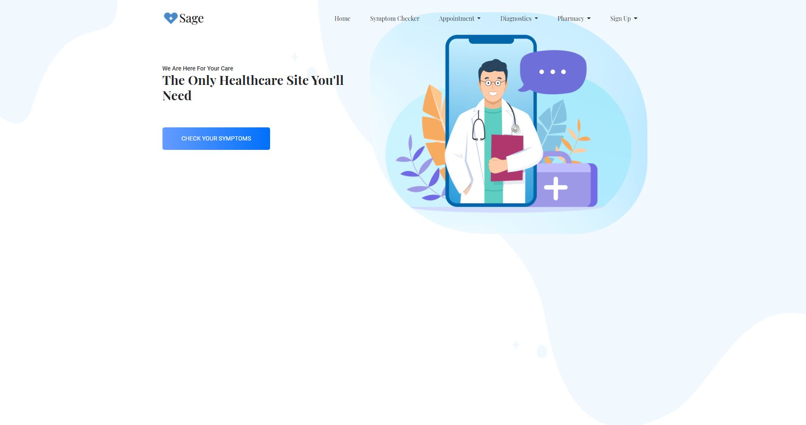
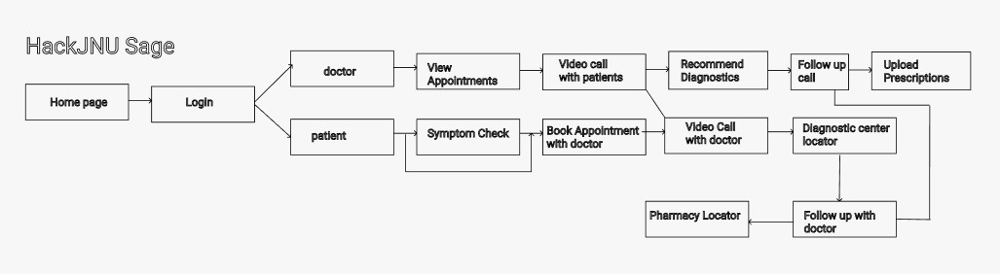
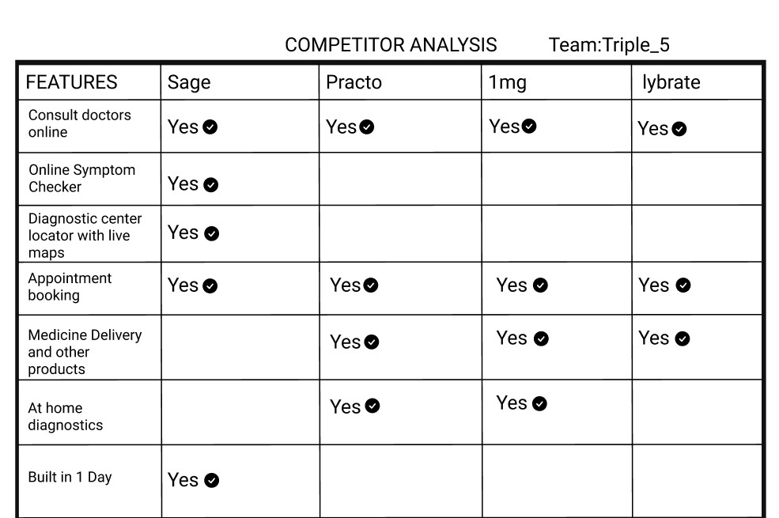
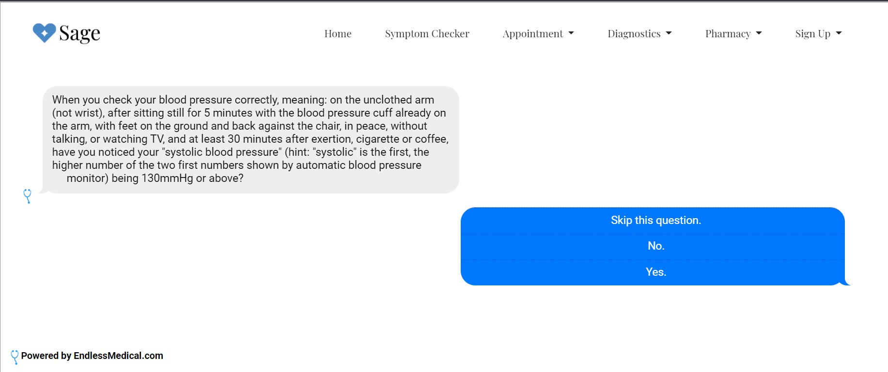
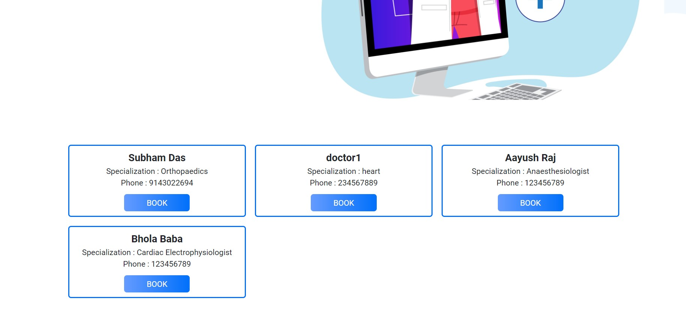
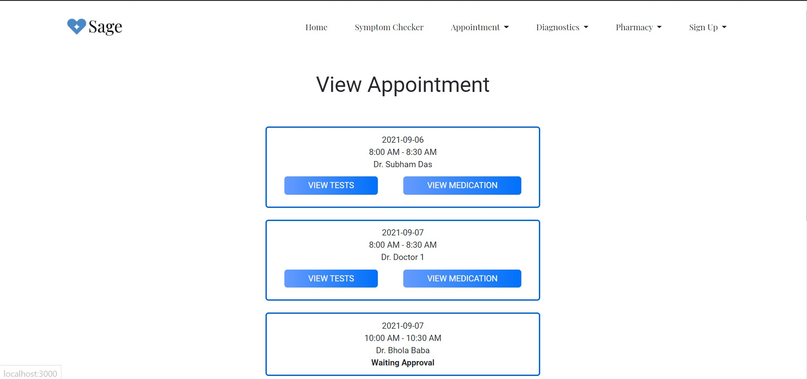
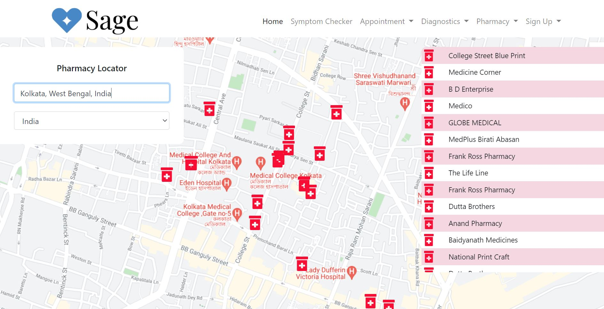
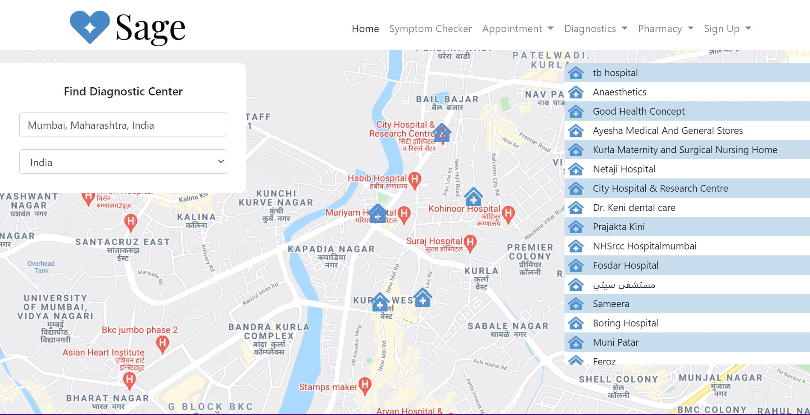

***

<!-- PROJECT LOGO -->
<br />
<p align="center">
  <a href="https://github.com/prabhavtewari/Sage_Hack_JNU_Triple_5/blob/main/public/img/logo.png">
    
  </a>

  <h3 align="center">Sage</h3>
  <p align="center">
  The only Healthcare Application you need!
</p>

***

[](https://forthebadge.com)
[](https://forthebadge.com)
[](https://forthebadge.com)
[](https://forthebadge.com)
[](https://forthebadge.com)
[](https://forthebadge.com)
[](https://forthebadge.com)

[](https://forthebadge.com)

[](https://forthebadge.com)


<!-- TABLE OF CONTENTS -->
<details open="open">
  <summary>Table of Contents</summary>
  <ol>
    <li>
      <a href="#about-the-project">About The Project</a>
      <ul>
        <li><a href="#built-with">Built With</a></li>
      </ul>
    </li>
    <li>
      <a href="#getting-started">Getting Started</a>
      <ul>
        <li><a href="#dependencies">Dependencies</a></li>
        <li><a href="#installation">Installation</a></li>
      </ul>
    </li>
    <li><a href="#how-to-use">How To Use</a></li>
    <li><a href="#acknowledgements">Acknowledgements</a></li>
    <li><a href="contributing">Contributing</a></li>
    <li><a href="license">License</a></li>
  </ol>
</details>

<!-- ABOUT THE PROJECT -->
## About The Project

Have you ever spent your time endlessly scrolling through google after a cold or sore throat, trying to figure out what has happened to you only to find gruesome results of you having either heart disease or cancer?
We should not have to deal with that, and therefore with the rising cases of misunderstood self-treatments and concerns for common healthcare in general, Team Triple_5 created Sage to amalgamate all the necessary steps for online treatment in a simple easy to use web application.


  <p align='center'>
<p align="center">

### Architecture Diagram

<p align='center'>
<p align="center">

### Competetive Analysis

<p align='center'>
<p align="center">

### Built With

* [Node.js](https://nodejs.org/en/)
* [Bootstrap](https://getbootstrap.com)
* [Express.js](https://expressjs.com)
* [MongoDB](https://www.mongodb.com/cloud)
* [Google Maps API](https://developers.google.com/maps)
* [Endless Medical API](https://endlessmedical.com/)
* [WebRTC](https://webrtc.org/)
* [Socket.io](https://socket.io/)
* [JWT](https://jwt.io/)
* [EJS](https://ejs.co/)


<!-- GETTING STARTED -->
## Getting Started


### Dependencies:

* Node-
  Go to [official Node.js website](https://nodejs.org/) and download the installer.
  
* Google Maps API key-
  Go to [Google Maps Platform](https://developers.google.com/maps) to get your free API key.
  
* MongoDB url-
  Visit [MongoDB](https://www.mongodb.com/) 
  
* Browser Version-Latest  
 
* npm
  ```sh
  npm install npm@latest -g
  ```


### Installation


    $ git clone https://github.com/prabhavtewari/Sage_Hack_JNU_Triple_5.git
    $ cd Sage_Hack_JNU_Triple_5.
    $ npm install
 

<!-- USAGE EXAMPLES -->
## Running

    nodemon
     //or
    node app.js
  
  ***
## How To Use
  
 With the help of the AI symptom checker, Sage first checks and determines what might be the particular disease or problem that you are facing using the  EndlessMedical API.
  

<p align='center'>
<p align="center">

  ***
  
Booking appointments online has never been easier with the help of Sage where patients can book appointments with registered doctors according to the required specialization and communicate or consult with them seamlessly through a video call.
  
Book Appointment:  
  
<p align='center'>
  <p align="center">
    
    
 View Appointment:
    
  <p align='center'>
  <p align="center">
    
  ***
  
  Find Diagnostic Centres and Pharmacies near you or anywhere that you search using google maps which displays them with all the relevant details and locations.
  
Pharmacy Locator:
<p align='center'>
<p align="center">

Diagnostic Centre Locator:
<p align='center'>
<p align="center">


***

<!-- ACKNOWLEDGEMENTS -->
## Acknowledgements

* [Google Maps API](https://developers.google.com/maps)
* [Endless Medical API](https://endlessmedical.com/)
* [Img Shields](https://shields.io)


<!-- CONTRIBUTING -->
## Contributing

Contributions are what make the open source community such an amazing place to be learn, inspire, and create. Any contributions you make are **greatly appreciated**.


<!-- LICENSE -->
## License

Distributed under the MIT License. See `LICENSE` for more information.
